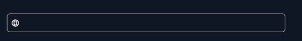

## Demo



# react-placeholder-typing

>The `react-placeholder-typing` is a customizable React component that displays an animated typing and deleting effect for placeholder text within an input field. The placeholders cycle through a list of specified strings, creating a typewriter or keyboard typing animation. The component accepts an icon and font family as customizable props, making it flexible for use in various projects and styles. Ideal for enhancing user interface and experience in projects where input fields are used."

[](https://www.npmjs.com/package/react-placeholder-typing) [](https://standardjs.com)

## Install

```bash
npm install --save react-placeholder-typing
```
or with yarn
```bash
yarn add react-placeholder-typing
```

## Usage

```jsx
import React, { Component, useState } from 'react'
import LanguageIcon from "@mui/icons-material/Language";
import ReactPlaceholderTyping from 'react-placeholder-typing'

const Example = () => {
  const placeholders = ['https://dubsub.ai', 'https://producthunt.com', 'https://www.indiehackers.com'];
  const [website, setWebsite] = useState('');

  return <ReactPlaceholderTyping
      placeholders={placeholders}
      value={website}
      onChange={(value) => {
        setWebsite(value)
      }}
      fontFamily={'Roboto'}
      renderIcon={() => (<LanguageIcon style={{color: '#f5f5f5'}}/>)}
    />
}
```
...

## Props

| Property       | Type     | Default | Description                                                          |
|----------------|----------|---------|----------------------------------------------------------------------|
| placeholders   | array    | []      | An array of placeholder texts to display in the typing animation.    |
| value          | string   | ""      | The current input value.                                             |
| onChange       | function | null    | Callback function that is called when the input value changes.       |
| fontFamily     | string   | "Arial" | The font family for the input field.                                 |
| renderIcon     | function | null    | A function that returns a JSX element to be used as the input icon.  |
| containerStyle | object   | {}      | style of the container if you want to modify the wrapper styles      |
| inputStyle     | object   | {}      | style of the input element if you want to modify the inputbox styles |


## License

MIT © [pashanitw](https://github.com/pashanitw)

## License

MIT © [pashanitw](https://github.com/pashanitw)
